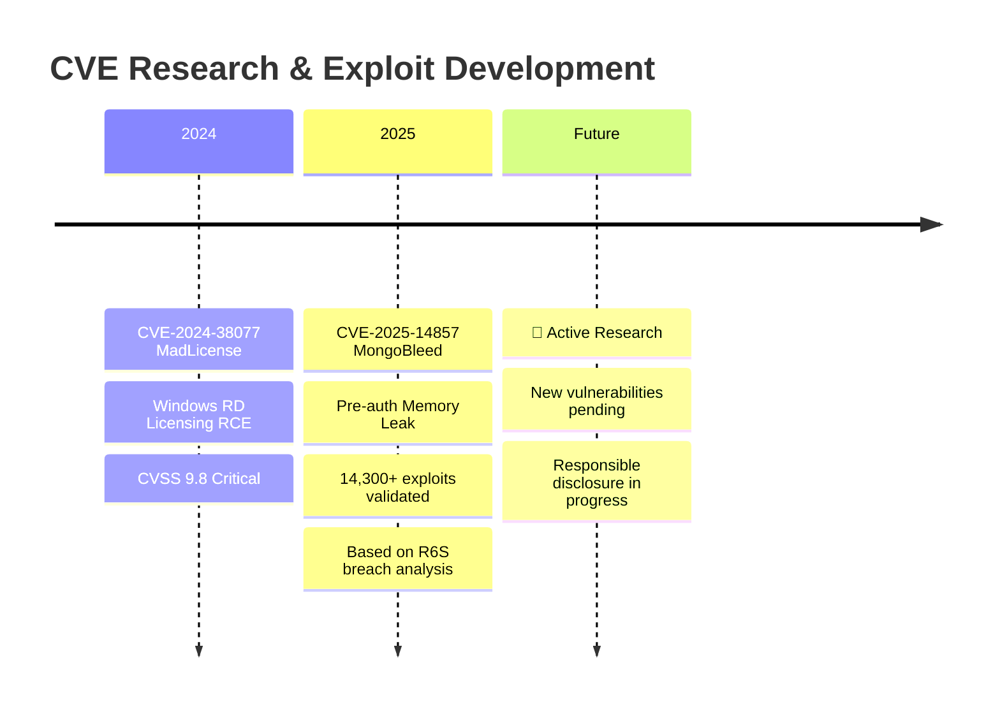

<div align="center">


<br/>

[](https://ermensonjr.com)
[](mailto:ermenson.sec@gmail.com)
[](https://www.linkedin.com/in/ermensonx)
[](https://github.com/Ermensonx)

</div>

---

## 💀 About Me

```rust
struct OffensiveSecuritySpecialist {
    name: &'static str,
    alias: &'static str,
    role: &'static str,
    specialization: Vec<&'static str>,
    cves_published: u8,
    vulns_found_production: u8,
}

impl OffensiveSecuritySpecialist {
    fn whoami() -> Self {
        Self {
            name: "Ermenson Marcos Rodrigues Jr",
            alias: "Ermensonx",
            role: "Offensive Security Specialist",
            specialization: vec![
                "Red Team Operations",
                "Web Application Pentesting", 
                "CVE Research & Exploit Dev",
                "Fintech Security Auditing",
                "Windows & Linux Exploitation"
            ],
            cves_published: 2,
            vulns_found_production: 16,
        }
    }
    
    fn status(&self) -> &str {
        "Finding critical vulnerabilities others miss 🎯"
    }
}
```

---

## 🏆 Achievements

<div align="center">

<table>
<tr>
<td align="center" width="33%">

### 🔴 CVE-2025-14857
**MongoBleed**
<br/>

<br/><br/>
Pre-auth heap memory leak in MongoDB 7.0.5
<br/>
**14,300+ successful exploits validated**
<br/>
Based on Rainbow Six Siege breach

</td>
<td align="center" width="33%">

### 🔴 CVE-2024-38077
**MadLicense**
<br/>

<br/><br/>
RCE in Windows RD Licensing Service
<br/>
**Unauthenticated Remote Code Execution**
<br/>
Full system compromise vector

</td>
<td align="center" width="33%">

### 🎯 Fintech Audit
**16 Vulnerabilities**
<br/>

<br/><br/>
2 Critical • 3 High • 6 Medium
<br/>
**Payment flow compromise vector**
<br/>
Full security assessment

</td>
</tr>
</table>

</div>

---

## ⚔️ Expertise

<div align="center">

```
┌──────────────────────────────────────────────────────────────────────────────┐
│                           OFFENSIVE SECURITY MATRIX                          │
├──────────────────┬──────────────────┬──────────────────┬────────────────────┤
│   🔴 RED TEAM    │  🌐 WEB SECURITY │   🔐 COMPLIANCE  │  🐍 DEVELOPMENT    │
├──────────────────┼──────────────────┼──────────────────┼────────────────────┤
│ APT Simulation   │ OWASP Top 10     │ PCI-DSS          │ Python/Rust        │
│ Social Eng.      │ API Hacking      │ ISO 27001/27002  │ Exploit Dev        │
│ OSINT & Recon    │ Auth Bypass      │ LGPD/GDPR        │ Custom Tooling     │
│ Phishing Ops     │ Business Logic   │ PTES/OSSTMM      │ PoC Development    │
│ Physical Sec     │ Source Code Rev  │ SOC 2            │ Automation         │
├──────────────────┴──────────────────┴──────────────────┴────────────────────┤
│  CVE Research • MongoDB Exploitation • Windows RCE • Memory Corruption      │
└──────────────────────────────────────────────────────────────────────────────┘
```

</div>

---

## 🛠️ Arsenal

<div align="center">

**Languages & Scripting**


**Offensive Tools**


**Platforms**


</div>

---

## 🚀 Featured Projects

<div align="center">

<a href="https://github.com/Ermensonx/CVE-2025-14857-MongoBleed">
  
</a>
<a href="https://github.com/Ermensonx/CVE-2024-38077-MadLicense-exploit">
  
</a>

<br/><br/>

<a href="https://github.com/Ermensonx/MyStealerLab">
  
</a>
<a href="https://github.com/Ermensonx/Desec-Scripts">
  
</a>

</div>

---

## 📊 GitHub Analytics

<div align="center">


<br/>


<br/>

<picture>
  <source media="(prefers-color-scheme: dark)" srcset="https://raw.githubusercontent.com/Ermensonx/Ermensonx/output/github-snake-dark.svg" />
  <source media="(prefers-color-scheme: light)" srcset="https://raw.githubusercontent.com/Ermensonx/Ermensonx/output/github-snake.svg" />
  
</picture>

</div>

---

## � Certifications & Training

<div align="center">

| Certification | Status | Organization |
|:---:|:---:|:---:|
| 🎓 **B.S. Information Systems** | 4th Semester | ITE |
| 🛡️ **DCPT** - Desec Certified Penetration Tester | 🔄 In Progress | Desec Security |
| 📜 **Advanced Web Hacking** | ✅ Completed | HackerSec |
| 📜 **OWASP Top 10 & API Security** | ✅ Completed | Various |

</div>

---

## 🔬 CVE Research Timeline

<div align="center">



</div>

---

## 📫 Let's Connect

<div align="center">

<a href="mailto:ermenson.sec@gmail.com">
  
</a>
<a href="https://ermensonjr.com">
  
</a>
<a href="https://www.linkedin.com/in/ermensonx">
  
</a>
<a href="https://github.com/Ermensonx">
  
</a>

<br/><br/>

> **"The only way to know if a system is secure is to try to break it."**

<br/>


</div>


